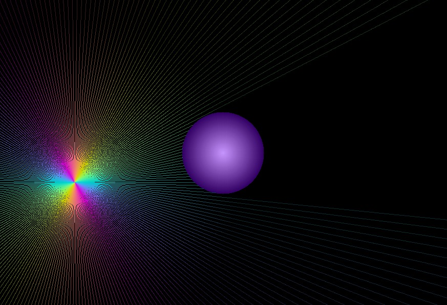

#  Rainbow Ray Tracing (SDL2)

This project is a simple **ray simulation** written in C using **SDL2**.  
It creates colorful rays that radiate outward from a moving source (your mouse),  
and they stop when they hit a circular obstacle.

---

##  Features
- Rays are dynamically generated from the mouse position.
- Rays cycle through a **rainbow color palette**.
- Rays **fade out** with distance for a glowing effect.
- Rays stop when they collide with a circular object.
- Minimal use of SDL2 (only surfaces and rectangles).

---

##  Demo
- Move your mouse inside the window → rays will follow.
- The white circle in the center acts as an obstacle.
- Rays fade out as they move further away.
---

## Screenshot
  

---

##  Requirements
- **C compiler** (GCC/Clang recommended)
- **SDL2** development libraries installed

On **Ubuntu/Debian**:
```bash
sudo apt-get install libsdl2-dev
```
```
make run
```
